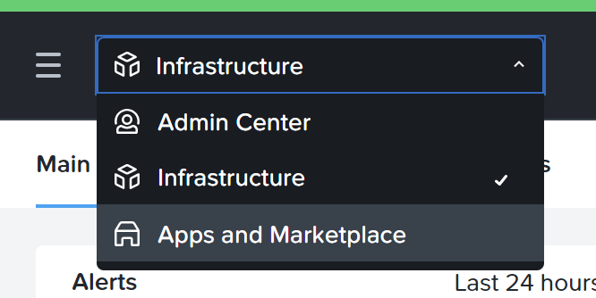
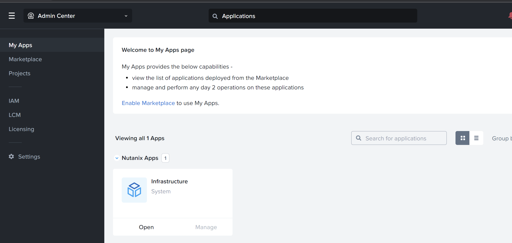
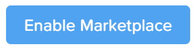
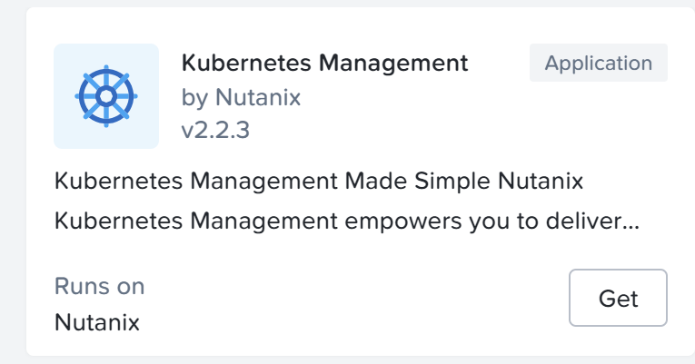
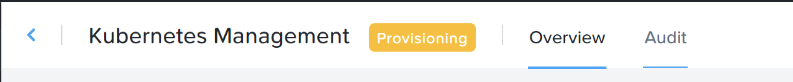
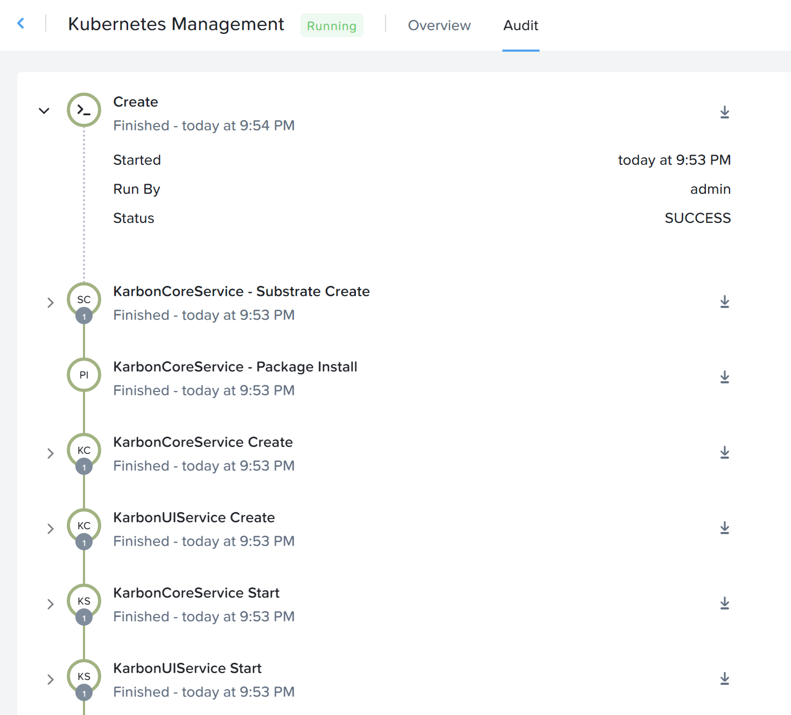
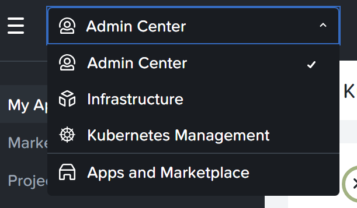
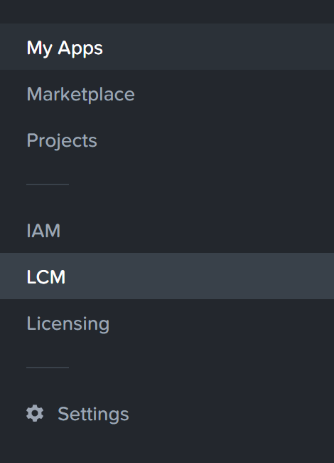
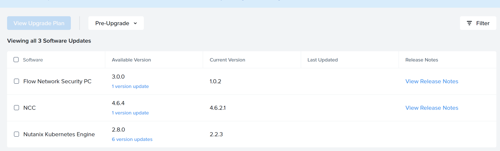

*Difficulty: 1/5*

# Summary:

This exercise will teach you how to deploy activate Nutanix Kubernetes Engine on a Nutanix Cluster. 

# Prerequisites
* A Nutanix cluster
* A Prism Central (>PC.2023.1.0.1), connected to his hosting cluster
* Admin credentials for this Prism Central

Note that this exercise can be done only once per Prism Central.

# Exercise

1. Enable Marketplace
    

    
Answer

    
    1. Connect on PC with admin user
    1. In the main menu, select `Apps and Marketplace`
         
    1. Click on `Enable Marketplace` link
         
    1. Click on `Enable Marketplace` blue button 
         
    1. Wait for few minutes (approx 8/10 mn)
    1. After Markeplace activation, the `get` button on the Marketplace tiles should not be greyed out anymore.
         
    
 
    
1. Deploy NKE
    

    
Answer

    
    1. Click on `Get` button on the `Kubernetes Management` tile
    2. Click now on `Deploy` blue button
    1. Click on `View admin center`
    1. Click on `audit` tab
         
    1. You can expand `Create` object and inspect deployment workflow.
    1. When all tasks are finshed (and green), you app will get `running` state
         

    
 

1. It is now recommanded to update NKE to the last version. Do it.
    

    
Answer

    
    1. In the main menu, select `Admin Center`
         
    1. In the left menu, select "LCM"
         
    1. Select `Inventory` tab
    1. Now click on `Perform inventory` blue button
    1. Wait for end of inventory (Can take a while)
    1. Click on `return to inventory`
    1. Click on `Updates` tab
    1. You should see a line `Nutanix Kubernetes Engine` in the list
         
    1. Check the box, and click on `View Upgrade Plan` blue button
    1. On the next page, click on `Apply 1 Update` blue button
    1. Wait for end of the update
        * NKE GUI is unavailable during the upgrade, but NKE clusters already deployed are still available.

    

