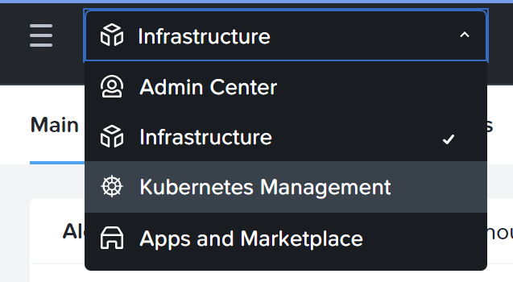
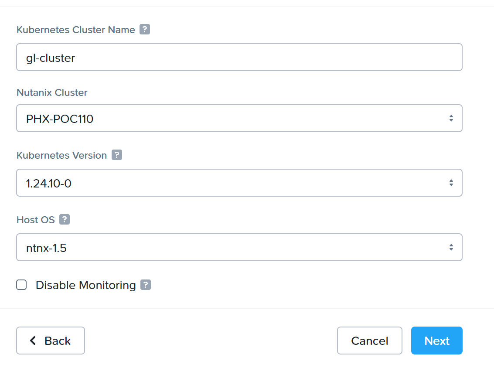
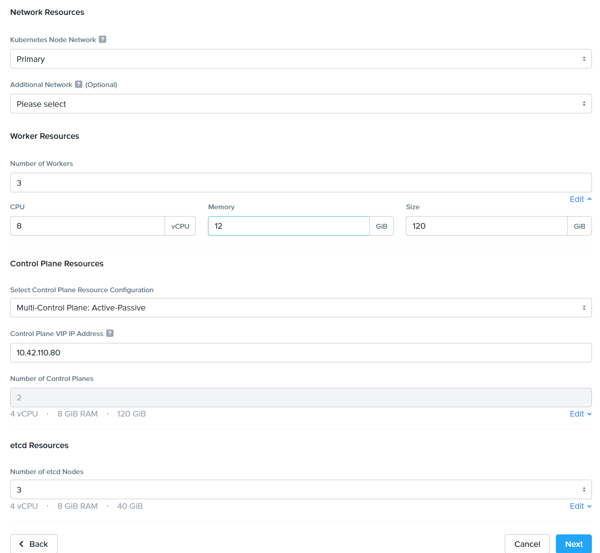
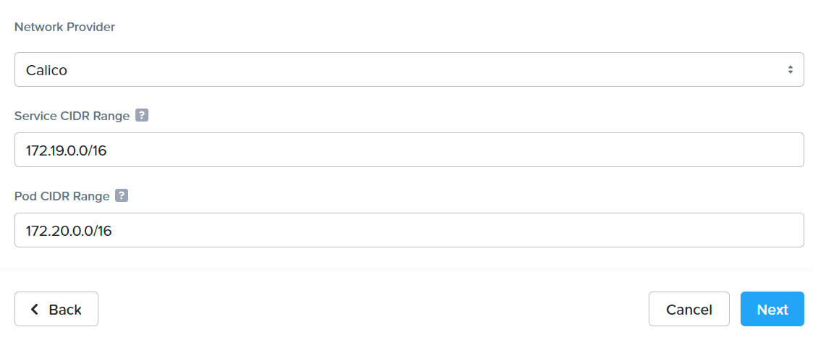
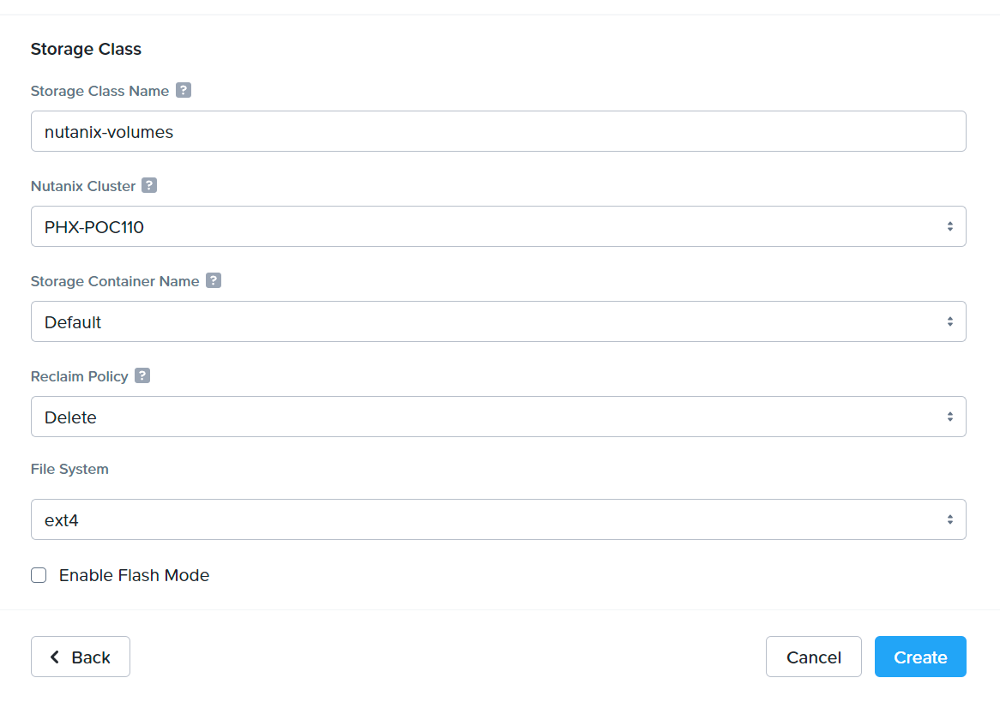
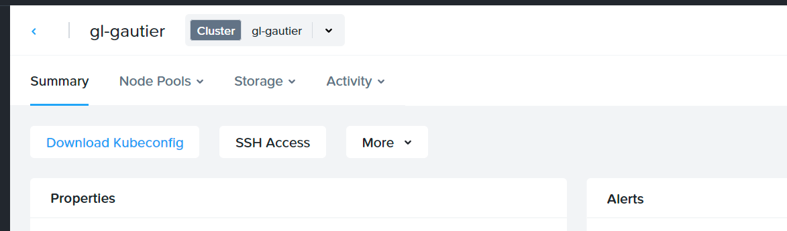

*Difficulty: 1/5*

## Summary:

This exercise will teach you how to activate Nutanix Kubernetes Engine in Prism Central. 

---

### Prerequisites
* A Nutanix cluster using AHV
    * ESXi is not supported for NKE clusters
* Nutanix Kubernetes Engine need to be activated in Prism [link]([https://portal.nutanix.com/page/documents/details?targetId=Nutanix-Kubernetes-Engine-v2_8:top-install-t.html) and up-to-date
* A Prism account authorized to deploy NKE clusters
* Network :
    * **Production clusters** : Configure an AHV network with IP address management (IPAM) enabled and IP pools configured.
    * **Development clusters** : Configure an AHV network with IPAM and IP address pools or with an external DHCP network.
* `kubectl` command must be installed on your laptop. 

---

## Exercise
1. Go on NKE page in Prism
    <details>
    <summary>Answer</summary>
    
    1. Connect on Prism with you account
    1. In the main menu, select `Kubernetes Management`
        <br>

    </details><br>

1. Look at the image list, and download the last 2 versions (if possible)
    <details>
    <summary>Answer</summary>
    
    1. In the left menu, select `OS images`
    1. In the main window, you should see a list of image available
    1. Use the `download` button of images you want to download
    1. Wait for end of image(s) download 

    </details><br>
    
1. Deploy a cluster, with these characteristics (use default ones if they are not specified here) :
    * Type : Production cluster
        * Note : if you do not have choice, use development one
    * name : \<your initials\>-cluster
        * Tip : NKE supports only lower chars and dash symbol
    * Nutanix cluster : choose the cluster of your choice (if you have many)
    * Kubernetes version : choose the **last version - 1** (it will allow us to test upgrade later)
    * Host OS : choose the **last version -1** (it will allow us to test upgrade later)
    * Network : Choose the network of your choice
    * Number of workers : 3
    * Change config of worker to setup : 8 vCPU, 12 GB of RAM and 120 GB of disk
    * Control plane configuration : Active-Passive
    * Control plane IP address : pick a free IP
        * Important : this IP must be outside the managed IP pool.
    * Number of etcd nodes : 3
    * CNI : Calico
    * Storageclass name : nutanix-volumes
    * Storage container name : pick up the container of your choice
    * Reclaim policy : Delete
    * File system : xfs

    <details>
    <summary>Answer</summary>
    
    1. In left Menu, click on `clusters`
    1. In the main window, click on `Create Kubernetes Workload`
    1. Select your cluster type (Probably `Production`)
    1. Click on `Next`
    1. Fill the form with the good inputs
        <br>
    1. Click on `Next` blue button
    1. Fill the next form with the good inputs
        <br>
    1. Click on `Next` blue button
    1. Select the CNI
    1. You can let the default IP range
        <br>
    1. Click on next
    1. Enter information for your storage-class
        * NKE deploys automatically a storage class to simply consume Nutanix block storage. This SC will be setuped as default class.
    
        <br>
    1. Finish by clicking on `Create` blue button
    1. Wait for end of cluster creation
        <br>
    1. Congrats, you have deployed your 1st kubernetes cluster
    </details><br>

1. Get kubeconfig file from NKE GUI
    <details>
    <summary>Answer</summary>
    
    1. In NKE GUI, click on the name of your cluster
    1. Click on the `Download kubeconfig` button
        <br>
    1. Put the file where you want on your laptop 
    </details><br>

1. Change your $KUBECONFIG variable to target this file
    <details>
    <summary>Answer</summary>
    
    1. Execute command `export KUBECONFIG=<path to the downloaded file>`
    </details><br>

1. Use kubectl command to get nodes list and validate k8s cluster connection
    <details>
    <summary>Answer</summary>
    You have 2 options :

    - As you have changed your `KUBECONFIG` environment variable value, you can launch command `kubectl get nodes`
    - You can also execute command `kubeconfig --kubeconfig <path to the downloaded file> get nodes`
    
    <br>You should have an output similar to this one :
    ```
    NAME                         STATUS   ROLES                  AGE   VERSION
    gl-gautier-b4d7aa-master-0   Ready    control-plane,master   22m   v1.24.10
    gl-gautier-b4d7aa-master-1   Ready    control-plane,master   21m   v1.24.10
    gl-gautier-b4d7aa-worker-0   Ready    node                   20m   v1.24.10
    gl-gautier-b4d7aa-worker-1   Ready    node                   19m   v1.24.10
    gl-gautier-b4d7aa-worker-2   Ready    node                   19m   v1.24.10 
    ```
    Note : etcd machines are not displayed, it is normal

    </details><br>


