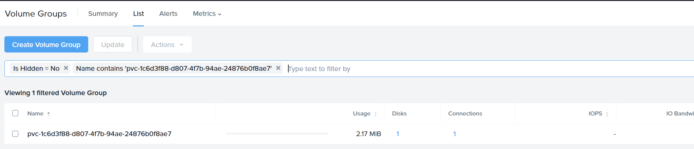

*Difficulty: 3/5*

# Summary:

This exercise will teach you how to use Nutanix CSI for block storage


# Prerequisites
* A Nutanix cluster with a kubernetes cluster deployed with NKE
* A Prism account authorized to deploy NKE clusters
* `kubectl` command must be installed on your laptop. 

# Presentation / Context

Nutanix provides a CSI driver to consume storage with kubernetes. 

The CSI driver can use block storage (using Nutanix Volumes) and files storage (usgin Nutanix Files). We often use block storage by default, for RWO (Read Write Once persistent Volume) and files storage for RWX (Read WRite Many) access.

To create a persistent volume (PV) on a Kubernetes cluster, you need to do a persistent volume claim (PVC). This PCV will use a storage class (SC) to get all needed informations to request PV creation. 

You can have (only) one default Storage Class on your kubernetes cluster. If your PVC does not specify Storage Class, the default one will be used.


# Exercise

## Create pod with persistent volume

1. Check it storage class exist on the cluster. Remember its name.
    <details>
    <summary>Answer</summary>
    
    > 1. Get kubeconfig file for your NKE cluster
    > 1. Then launch command `kubectl get storageclass`
    >     <br>You shloud have this output : 
    >     ```
    >     NAME                        PROVISIONER       RECLAIMPOLICY   VOLUMEBINDINGMODE   ALLOWVOLUMEEXPANSION   AGE
    >     nutanix-volumes (default)   csi.nutanix.com   Delete          Immediate           true                   32h
    >     ```
    > 1. Check it is the default storage class

    </details><br>
1. Look at these pages : [link](https://portal.nutanix.com/page/documents/details?targetId=CSI-Volume-Driver-v2_6:csi-csi-plugin-deploy-pvc-t.html) & [link](https://portal.nutanix.com/page/documents/details?targetId=CSI-Volume-Driver-v2_6:csi-csi-plugin-create-volume-claim-volumes-t.html)
1. Create a manidfest to deploy :
    * a deployment of 1 pod with image : \<to be defined\>
    * a 5GB pvc using this storage class, in RWO mode
        * this volume will be mounted in /data in the pod
    * a ClusterIP service to access to this pod
    <details>
    <summary>Answer</summary>

    >```yaml
    >---
    >kind: PersistentVolumeClaim
    >apiVersion: v1
    >metadata:
    >name: my-pvc
    >spec:
    >accessModes:
    >    - ReadWriteOnce
    >resources:
    >    requests:
    >        storage: 5Gi
    >--- 
    >apiVersion: apps/v1
    >kind: Deployment
    >metadata:
    >name: my-dep
    >labels:
    >    app: my-app
    >spec:
    >replicas: 1
    >selector:
    >    matchLabels:
    >    app: my-app
    >template:
    >    metadata:
    >    labels:
    >        app: my-app
    >    spec:
    >    containers:
    >    - name: my-cont
    >        image: gautierleblanc/nke_lab_1:latest
    >        imagePullPolicy: Always
    >        volumeMounts:
    >            - mountPath: /data
    >            name: mypvc
    >    volumes:
    >        - name: mypvc
    >        persistentVolumeClaim:
    >            claimName: my-pvc
    >---
    >apiVersion: v1
    >kind: Service
    >metadata:
    >name: my-svc
    >spec:
    >selector:
    >    app: my-app
    >ports:
    >    - protocol: TCP
    >    port: 80
    >    targetPort: 80
    >```
    ></details><br>
1. Apply the manifest
    <details>
    <summary>Answer</summary>
    
    > 1. Create a namespace with the command `kubectl create ns <your namespace name>`
    > 1. Launch command `kubectl apply -f <your manifest file> -n <your namespace>`

    </details><br>
1. Verify pod is running
    <details>
    <summary>Answer</summary>
    
    > 1. Launch command `kubectl get pods -n <your namespace>`
    >     <br>You shloud have this output : 
    >     ```
    >     NAME                      READY   STATUS    RESTARTS   AGE
    >     my-dep-7c784c98c4-hd6kt   1/1     Running   0          3m24s
    >     ```
    > 1. Check your pod state. It sould be : `running`

    </details><br>
1. Display your pvc
    <details>
    <summary>Answer</summary>
    
    > 1. Launch command `kubectl get pvc -n <your namespace>`
    >     <br>You shloud have this output : 
    >     ```
    >     NAME     STATUS   VOLUME                                     CAPACITY   ACCESS MODES   STORAGECLASS      AGE
    >     my-pvc   Bound    pvc-1c6d3f88-d807-4f7b-94ae-24876b0f8ae7   5Gi        RWO            nutanix-volumes   4h15m
    >     ```
    > 1. Remember volume name

    </details><br>
1. Look at prism central, in the VG list (`Infrastructure Menu > Compute & Storage > Volume Groups` ), check if your volume is here.
    <details>
    <summary>Answer</summary>

    > You should be able to list it
    > <br>
    </details><br>

1. Launch shell on this pod, and create a "/data/data.txt" file with any string you want as content.
    <details>
    <summary>Answer</summary>
    
    > 1. Launch command `kubectl exec -it <name of your pod> -n <your namespace> -- bash`
    > 1. In the shell, use command `echo "<your data here>" > /data/data.txt`
    > 1. Quit with `Ctrl+D`

    </details><br>

1. Create a port forward from localhost:8080 to the port 80 of this 

    <details>
    <summary>Answer</summary>
    
    > 1. Launch command `kubectl port-forward services/<your service> 8080:80 -n <your namespace> --address 0.0.0.0`

    Note : as soon as you do a `Ctrl+C` to get your shell back, port-forwarding will be stopped. Do not forget to relaunch it when needed.

    </details><br>

1. Launch your web browser and connect on your app (http://localhost:8080)

## Extend your PV to 6GB

1. Look at this page : [link](https://portal.nutanix.com/page/documents/details?targetId=CSI-Volume-Driver-v2_6:csi-csi-plugin-expand-volume-t.html)
1. Create a manifest to extend your previous PV (or just modify the previous one)
    <details>
    <summary>Answer</summary>

    >```yaml
    >kind: PersistentVolumeClaim
    >apiVersion: v1
    >metadata:
    >name: my-pvc
    >spec:
    >accessModes:
    >    - ReadWriteOnce
    >resources:
    >    requests:
    >        storage: 6Gi
    >```

    </details><br>
1. Apply it
    <details>
    <summary>Answer</summary>
    
    > 1. Launch command `kubectl apply -f <your manifest file> -n <your namespace>`

    </details><br>
1. Display PVC information
    <details>
    <summary>Answer</summary>
    
    > 1. Launch command `kubectl get pvc -n <your namespace>`

    </details><br>
1. Look at your volume group in Prism Central
    <details>
    <summary>Answer</summary>
    
    > 1. Launch command `kubectl get pv <your pv name>`

    </details><br>

1. Look at VG list in Prism, you should see the new PV size displayed in the details of the VG 
1. Refresh app in your web browser

## Clone your PV

1. Look at this page : [link](https://portal.nutanix.com/page/documents/details?targetId=CSI-Volume-Driver-v2_6:csi-csi-driver-clone-pvc-t.html)    
1. Create a second app based on the same manifest, but using a clone of your PVC

    <details>
    <summary>Answer</summary>

    >```yaml
    >apiVersion: v1
    >kind: PersistentVolumeClaim
    >metadata:
    >name: my-pvc-clone
    >spec:
    >dataSource:
    >    name: my-pvc
    >    kind: PersistentVolumeClaim
    >accessModes:
    >    - ReadWriteOnce
    >resources:
    >    requests:
    >    storage:  6Gi
    >--- 
    >apiVersion: apps/v1
    >kind: Deployment
    >metadata:
    >name: my-dep-clone
    >labels:
    >    app: my-app-clone
    >spec:
    >replicas: 1
    >selector:
    >    matchLabels:
    >    app: my-app-clone
    >template:
    >    metadata:
    >    labels:
    >        app: my-app-clone
    >    spec:
    >    containers:
    >    - name: my-cont
    >        image: gautierleblanc/nke_lab_1:latest
    >        imagePullPolicy: Always
    >        volumeMounts:
    >            - mountPath: /data
    >            name: mypvc-clone
    >    volumes:
    >        - name: mypvc-clone
    >        persistentVolumeClaim:
    >            claimName: my-pvc-clone
    >---
    >apiVersion: v1
    >kind: Service
    >metadata:
    >name: my-svc-app-clone
    >spec:
    >selector:
    >    app: my-app-clone
    >ports:
    >    - protocol: TCP
    >    port: 80
    >    targetPort: 80
    >```
    
    </details><br>

1. Display pvc from your namespace
    <details>
    <summary>Answer</summary>
    
    > 1. Launch command `kubectl get pvc -n <your namespace>`
    > 1. You should see the new PVC displayed in the list

    </details><br>
1. Display pv from your namespace
    <details>
    <summary>Answer</summary>
    
    > 1. Launch command `kubectl get pv`
    > 1. You should see the new PV displayed in the list

    </details><br>
1. Create another port forward from localhost:8081 to the port 80 of the new service

    <details>
    <summary>Answer</summary>
    
    > 1. Launch command `kubectl port-forward services/<your service> 8081:80 -n <your namespace> --address 0.0.0.0`

    </details><br>

1. Display app in your web browser (https://localhost:8081)
1. Cleaning time ! Delete all elements of your cloned app
    <details>
    <summary>Answer</summary>
    
    > 1. Launch command `kubectl delete -f <path to your manifest> -n <your namespace>`

    </details><br>

## Snapshot your PV and restore it

1. Look at this page : [link](https://portal.nutanix.com/page/documents/details?targetId=CSI-Volume-Driver-v2_6:csi-csi-driver-create-snapshot-c.html)
1. Create a manifest to snapshot your PV and apply it
    <details>
    <summary>Answer</summary>
    
    > 1. Create a manifest to create a snapshot class. Warning, your secret name can be different, check this point first. 
    >    ```yaml
    >    apiVersion: snapshot.storage.k8s.io/v1
    >    kind: VolumeSnapshotClass
    >    metadata:
    >    name: nutanix-volume-snapshot-class
    >    driver: csi.nutanix.com
    >    parameters:
    >    storageType: NutanixVolumes
    >    csi.storage.k8s.io/snapshotter-secret-name: ntnx-secret
    >    csi.storage.k8s.io/snapshotter-secret-namespace: kube-system
    >    deletionPolicy: Delete
    >    ```
    > 1. Apply it with command `kubectl apply -f <your maninifest file> -n <your namespace>`
    > 1. Create another manifest to clone your 1st pvc
    >    ```yaml
    >    apiVersion: snapshot.storage.k8s.io/v1
    >    kind: VolumeSnapshot
    >    metadata:
    >    name: my-snapshot
    >    spec:
    >    volumeSnapshotClassName: nutanix-volume-snapshot-class
    >    source:
    >        persistentVolumeClaimName: my-pvc
    >    ```
    > 1. Apply it with command `kubectl apply -f <your maninifest file> -n <your namespace>`

    </details><br>
1. Check if your snapshot is existing
    <details>
    <summary>Answer</summary>
    
    > 1. Launch command `kubectl get volumesnapshots -n <your namespace>`
    > 1. It should have "ReadyToUse" information to `true`

    </details><br>
1. Connect on your running pod and delete /data/data.txt file
    <details>
    <summary>Answer</summary>
    
    > 1. Launch command `kubectl exec -it <name of your pod> -n <your namespace> -- bash`
    > 1. In the shell, use command `rm /data/data.txt`
    > 1. Quit with `Ctrl+D`

    </details><br>
1. Check app in your browser
1. Scale your deployment to 0
    <details>
    <summary>Answer</summary>
    
    > 1. Launch command `kubectl scale deployment <your deployment name> --replicas 0 -n <your namespace>`

    </details><br>
1. Create a PVC from snapshot
    <details>
    <summary>Answer</summary>
    
    > 1. Create this manifest
    >    ```yaml
    >    apiVersion: v1
    >    kind: PersistentVolumeClaim
    >    metadata:
    >    name: my-pcv-from-snap
    >    spec:
    >    dataSource:
    >        name: my-snapshot
    >        kind: VolumeSnapshot
    >        apiGroup: snapshot.storage.k8s.io
    >    accessModes:
    >        - ReadWriteOnce
    >    resources:
    >        requests:
    >          storage: 6Gi
    >    ```
    > 1. Launch command `kubectl apply -f <your manifest> -n <your namespace>`

    </details><br>
1. Update your deployment to use new pvc
    <details>
    <summary>Answer</summary>
    
    > 1. Edit your deployment manifiest, and change pvc name
    > 1. Apply the new manifest
    > 1. Pod should be recreated
    > 1. Wait for running state

    </details><br>
1. Connect on your application, verify you get back your file.

# Takeover

Nutanix CSI configured in block mode can do : clone, snap and restore.

